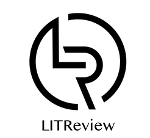

## Table of Contents
1. [General Info](#general-info)
2. [Technologies](#technologies)
3. [Installation](#installation)
4. [Collaboration](#collaboration)
5. [FAQs](#faqs)
### General Info
***
Litreview est une application web permettant de demander ou publier des critiques de livres ou d’articles.
L’application présente deux cas d’utilisation principaux : 
-Les personnes qui demandent des critiques sur un livre ou sur un article particulier ;
-Les personnes qui recherchent des articles et des livres intéressants à lire, en se basant sur les critiques des autres.
### Logo

## Technologies
***
A list of technologies used within the project:
* [Python3](https://example.com): Version 3.9.7 
* [Django](https://example.com): Version 4.0
* [python-dateutil](https://example.com)
## Installation
***
A little intro about the installation. 
```
$ pipenv install
$ pipenv shell
$ git clone https://github.com/arthurmengual/P9.git
$ pipen install [packages]
$ cd litreview
$ ./manage.py migrate
$ ./manage.py runserver
```
Side information: To use the application in a special environment use ```lorem ipsum``` to start
## Collaboration
***
Give instructions on how to collaborate with your project.
> Maybe you want to write a quote in this part. 
> It should go over several rows?
> This is how you do it.
## FAQs
***
A list of frequently asked questions
1. **This is a question in bold**
Answer of the first question with _italic words_. 
2. __Second question in bold__ 
To answer this question we use an unordered list:
* First point
* Second Point
* Third point
3. **Third question in bold**
Answer of the third question with *italic words*.
4. **Fourth question in bold**
| Headline 1 in the tablehead | Headline 2 in the tablehead | Headline 3 in the tablehead |
|:--------------|:-------------:|--------------:|
| text-align left | text-align center | text-align right |
